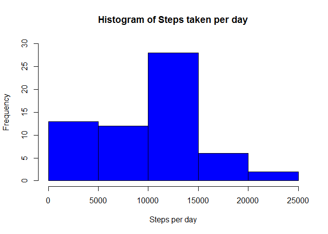
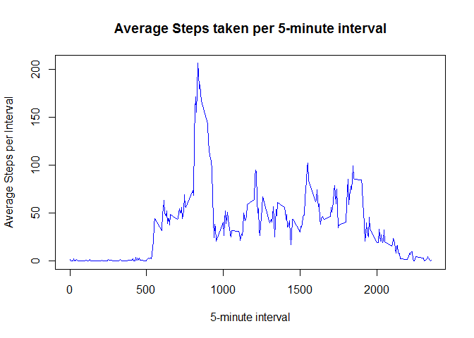
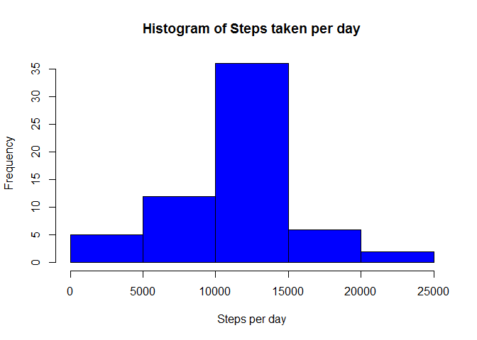

“RMarkdown and Knitter Assignment”
==================================

This report answers the questions of the “Peer-graded Assignment: Course
Project 1”

Loading Data
------------

Before answering the questions, we need to load data into R with the
following code:

    unzip("activity.zip")
    db <- read.csv("activity.csv", header=TRUE,sep=",",na.strings="NA")
    db$dates <- as.factor(as.Date(as.character(db$date),format="%Y-%m-%d"))

In addition to loading the data, an additional column ‘dates’ was
created as a field containing the dates as factor levels.

Question 1
----------

This question is made up of the following parts: 1) Calculate the total
number of steps taken per day; 2) Make a histogram of the total number
of steps taken each day; 3) Calculate and report the mean and median of
the total number of steps taken per day  
For this part of the assignment, the missing values in the dataset are
ignored.

The required histogram is exhibited below the following code.

    stepsday <- aggregate(db$steps,by=list(db$dates),FUN=sum, na.rm = TRUE)
    names(stepsday) <- c("Date","Steps_per_Day")

    hist(stepsday$Steps_per_Day, main="Histogram of Steps taken per day",
         xlab="Steps per day", col="Blue", ylim=c(0,30))

    avg <- mean(stepsday$Steps_per_Day)
    med <- median(stepsday$Steps_per_Day)

The mean is: 9354.2 and the median is: 10395

Question 2
----------

This question is made up of the following parts: 1) Make a time series
plot (i.e. type = “l”) of the 5-minute interval (x-axis) and the average
number of steps taken, averaged across all days (y-axis)  
For this part of the assignment, the missing values in the dataset are
ignored.

The required time series plot is exhibited below the following code.

    stepsinterval <- aggregate(db$steps,by=list(db$interval),FUN=mean, na.rm = TRUE)
    names(stepsinterval) <- c("Interval","Average_Steps_per_Interval")

    plot(stepsinterval$Interval,stepsinterval$Average_Steps_per_Interval, type="l",
         main="Average Steps taken per 5-minute interval",
         xlab="5-minute interval",ylab="Average Steps per Interval", col="Blue")

    maxint <- stepsinterval[stepsinterval$Average_Steps_per_Interval==
                    max(stepsinterval$Average_Steps_per_Interval),1]

The 5-minute interval, on average across all the days in the dataset,
that contains the maximum number of steps is: 835

Question 3
----------

1.  Calculate and report the total number of missing values in the
    dataset (i.e. the total number of rows with NAs)
2.  Devise a strategy for filling in all of the missing values in the
    dataset.The strategy does not need to be sophisticated. For example,
    you could use the mean/median for that day, or the mean for that
    5-minute interval, etc
3.  Create a new dataset that is equal to the original dataset but with
    the missing data filled in
4.  Make a histogram of the total number of steps taken each day and
    calculate and report the mean and median total number of steps taken
    per day. Do these values differ from the estimates from the first
    part of the assignment? What is the impact of imputing missing data
    on the estimates of the total daily number of steps?

<!-- -->

    x <- table(is.na(db[1]))[2][[1]]

There are 2304 missing values in the dataset

The strategy consists of filling in the missing values with the
corresponding mean value of the interval. The dataset keeps its name
‘db’ but missing values in column ‘steps’ are now filled with the
corresponding mean value.

    stepsinterval <- aggregate(db$steps,by=list(db$interval),FUN=mean, na.rm = TRUE)
    names(stepsinterval) <- c("Interval","Average_Steps_per_Interval")
    db$steps[is.na(db$steps)==TRUE] <- stepsinterval[stepsinterval==db$interval,2]

The required histogram is exhibited below the following code.

    stepsday <- aggregate(db$steps,by=list(db$dates),FUN=sum)
    names(stepsday) <- c("Date","Steps_per_Day")

    hist(stepsday$Steps_per_Day, main="Histogram of Steps taken per day",
         xlab="Steps per day", col="Blue")

    options("scipen"=100, "digits"=1)
    avg2 <- mean(stepsday$Steps_per_Day)
    med2 <- median(stepsday$Steps_per_Day)

The mean is: 10766.2 and the median is: 10766.2. These values differ
from the ones obtained on question 1, being greater than those.

Question 4
----------

1.  Create a new factor variable in the dataset with two levels –
    “weekday” and “weekend” indicating whether a given date is a weekday
    or weekend day
2.  Make a panel plot containing a time series plot (i.e. type = “l”) of
    the 5-minute interval (x-axis) and the average number of steps
    taken, averaged across all weekday days or weekend days (y-axis)

The new factor variable is introduced with the following code and store
in column ‘type’

    db$daynum <- as.POSIXlt(db$date)$wday
    db$type = "weekday"
    db$type[db$daynum==0 | db$daynum==6] <- "weekend"
    db$type <- as.factor(db$type)

The plot is built with the following code, and exhibited below

    stepsinterval <- aggregate(db$steps,by=list(db$interval,db$type),FUN=mean, na.rm = TRUE)
    names(stepsinterval)<-c("Interval","Type_of_day","Average_Steps_per_Interval")

    par(oma=c(1,1,1,1))
    par(mar=c(4,4,1,1))
    par(mfrow=c(2,1))
    stepsint1 <- subset(stepsinterval,stepsinterval$Type_of_day=="weekday")
    stepsint2 <- subset(stepsinterval,stepsinterval$Type_of_day=="weekend")
    plot(stepsint1$Interval,stepsint1$Average_Steps_per_Interval, type="l",
         main="Weekdays",xlab="5-minute interval",ylab="Average Steps per Interval", col="Blue")
    plot(stepsint2$Interval,stepsint2$Average_Steps_per_Interval, type="l",
         main="Weekend days",
         xlab="5-minute interval",ylab="Average Steps per Interval", col="Green")

